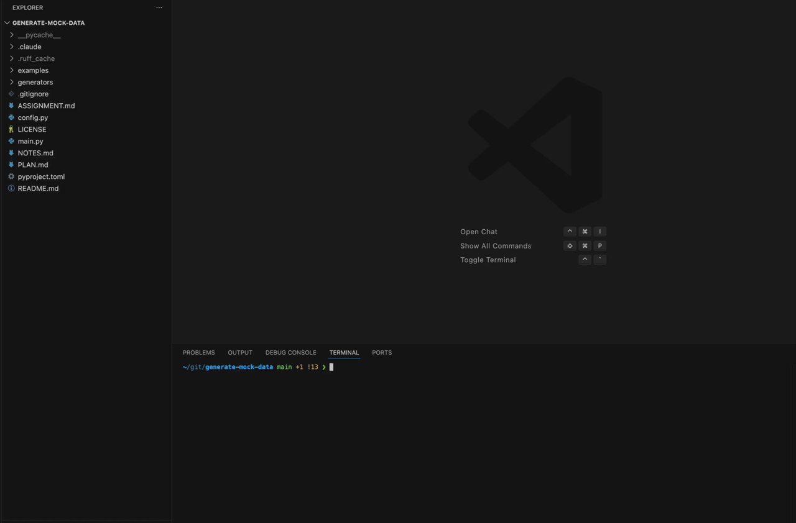

# generate-mock-data

A Claude Code skill that generates realistic security demo data for fictional companies. 

Feed it a short prompt (or no prompt for random data) like `500 person healthcare company` and it produces internally consistent CloudTrail logs, auth events, endpoint telemetry, IAM configurations, and embedded security scenarios.

## Overview

Demo environments often fail to simulate a realistic environment because the data is either too clean or obviously fake. This generator creates a complete, internally consistent security environment for a fictional company with the intentionally flawed data throughout (orphaned accounts, inconsistent tags, partial MFA rollouts).

The primary interface is a **Claude Code skill** that accepts a natural-language prompt. Python generators handle the actual data creation, producing both JSON and YAML output across 6 data types and 6 security scenarios.

## Documentation

| Document                       | Description                                                                                |
| ------------------------------ | ------------------------------------------------------------------------------------------ |
| [README.md](README.md)         | Project overview, installation, usage, and output reference                                |
| [ASSIGNMENT.md](ASSIGNMENT.md) | Original assignment and evaluation criteria                                                |
| [PLAN.md](PLAN.md)             | Claude implementation plan — architecture, data flow, skill design, and verification steps |
| [NOTES.md](NOTES.md)           | Design decisions and tradeoffs                                                             |

## Project Structure

```
generate-mock-data/
├── main.py                 # orchestration + dual-format file output
├── config.py               # company profile dataclass + defaults
├── generators/
│   ├── company.py          # employees, departments, groups, service accounts
│   ├── aws_iam.py          # IAM users, roles, policies, S3/EC2 resources
│   ├── aws_cloudtrail.py   # daily CloudTrail event generation
│   ├── auth_events.py      # login/MFA/session events
│   ├── endpoints.py        # device inventory + process events
│   └── scenarios.py        # 6 security anomaly injections
├── .claude/skills/
│   └── generate-mock-data/
│       └── SKILL.md        # Claude Code skill definition
├── examples/               # sample output
├── pyproject.toml          # dependencies + ruff config
├── ASSIGNMENT.md           # original assignment overview
├── PLAN.md                 # implementation plan and architecture
└── NOTES.md                # design decisions and tradeoffs
```

## Requirements

- **Python 3.10+** (tested on 3.14.3)
- **Claude Code** (for the `/generate-mock-data` skill interface)
- `faker` (>=28.0) and `pyyaml` (>=6.0) — install with `pip install faker pyyaml`

## Installation

```bash
git clone https://github.com/zantinelli/generate-mock-data.git && cd generate-mock-data
pip install faker pyyaml

# Now open a claude code session from the project directory
claude
```

## Usage

### Via Claude Code Skill

The skill auto-registers from the `.claude/skills/` directory when a claude session is opened in project directory:

```
/generate-mock-data 500 person healthcare company
```

Or with no prompt for fully random defaults (random industry, random size 100-2000):

```
/generate-mock-data
```



**Supported industries:**

|             |             |               |              |
| ----------- | ----------- | ------------- | ------------ |
| aerospace   | agriculture | biotech       | construction |
| consulting  | defense     | education     | energy       |
| fintech     | healthcare  | hospitality   | insurance    |
| legal       | logistics   | manufacturing | media        |
| real-estate | retail      | saas          | telecom      |

### Via Python Directly

```bash
python main.py --size 500 --industry healthcare
python main.py --size 150 --industry fintech --name NovaPay --seed 42
python main.py --days 14 --output my_data  # custom window and output dir
python main.py  # random industry + size 100-2000
```

| Flag         | Default         | Description                         |
| ------------ | --------------- | ----------------------------------- |
| `--size`     | Random 100-2000 | Number of employees                 |
| `--industry` | Random          | Company industry                    |
| `--name`     | Generated       | Company name                        |
| `--seed`     | None            | Random seed for reproducible output |
| `--days`     | 30              | Days of activity to generate        |
| `--output`   | `data`          | Output directory                    |

## Eample output

Output is written to `data/<company-name>/` with every data source in both JSON and YAML:

```
data/<company-name>/
├── SUMMARY.md                            # generated data summary
├── company/
│   ├── employees.{json,yaml}          # full employee directory
│   ├── departments.{json,yaml}        # org structure with headcount
│   ├── groups.{json,yaml}             # security/access groups
│   └── service_accounts.{json,yaml}   # CI/CD and integration accounts
├── cloud/aws/
│   ├── iam/
│   │   ├── users.{json,yaml}          # IAM users mapped to employees
│   │   ├── roles.{json,yaml}          # IAM roles (incl. legacy)
│   │   ├── policies.{json,yaml}       # custom policies (some overly broad)
│   │   └── resources.{json,yaml}      # S3 buckets + EC2 instances
│   └── cloudtrail/
│       └── YYYY-MM-DD.{json,yaml}     # daily API event logs
├── identity/
│   └── auth_events/
│       └── YYYY-MM-DD.{json,yaml}     # login/MFA/session events
├── endpoints/
│   ├── devices.{json,yaml}            # device inventory
│   └── process_events/
│       └── YYYY-MM-DD.{json,yaml}     # process execution telemetry
└── alerts/
    └── security_findings.{json,yaml}  # findings from embedded scenarios
```

## Embedded Security Scenarios

Six scenarios are injected into the baseline activity at specific points in the timeline:

| Scenario               | Severity | What to look for                                                             |
| ---------------------- | -------- | ---------------------------------------------------------------------------- |
| Credential stuffing    | CRITICAL | 50-75 failed logins from single IP, then 1-2 successes                       |
| Data exfiltration      | CRITICAL | 300-500 S3 GetObject calls in 2 hours (baseline: 5-10/day)                   |
| Privilege escalation   | CRITICAL | User calls `iam:PutUserPolicy` on their own account, then accesses secrets   |
| Impossible travel      | CRITICAL | Login from NYC then Singapore 20 minutes later, different device, no MFA     |
| Over-permissioned user | HIGH     | Non-technical employee with `AdministratorAccess`, only doing basic S3 reads |
| Off-hours prod access  | MEDIUM   | Engineer hitting prod S3/EC2 at 2-4am UTC                                    |

Each scenario references real employees and IAM users from the generated data, so the findings are traceable end-to-end.

## Realistic Imperfections

The data intentionally includes imperfections to emulate real data:

- **Missing fields**: 5-15% of records omit optional fields (phone, manager, userAgent, serial number)
- **Stale accounts**: Terminated employees still have active IAM users and assigned devices
- **Tag inconsistency**: Mix of `costCenter`, `cost_center`, and missing tags across resources
- **Legacy artifacts**: Admin role marked "DO NOT USE" still active; deprecated service account still running
- **Partial MFA**: 80% enrolled, 10% pending, 10% not enrolled
- **Stale credentials**: Backup service account not rotated in 400+ days
- **Timezone drift**: ~3% of timestamps use local offset instead of UTC
- **Duplicate entries**: Service account exists under two names (original + `-legacy`), both active

## Example Output

Two example companies are included in `examples/`:

**NovaPay** — 150-person fintech (seed 42):

- `examples/novapay/SUMMARY.md` — generated data summary
- `examples/novapay/alerts/security_findings.json` — all 6 scenario findings
- `examples/novapay/company/employees.json` — employee directory with imperfections
- `examples/novapay/identity/auth_events/2026-04-09.json` — day with credential stuffing attack

**James-Greene** — 500-person healthcare (seed 99):

- `examples/james-greene/SUMMARY.md` — generated data summary
- `examples/james-greene/alerts/security_findings.json` — all 6 scenario findings
- `examples/james-greene/company/employees.json` — 500 employees across 13 departments
- `examples/james-greene/identity/auth_events/2026-03-31.json` — day with credential stuffing attack
